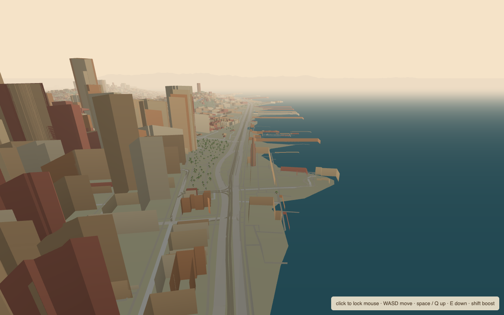
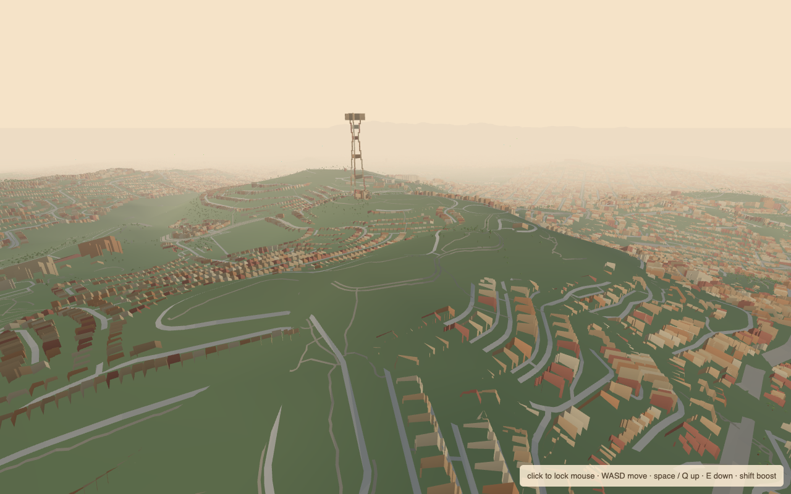
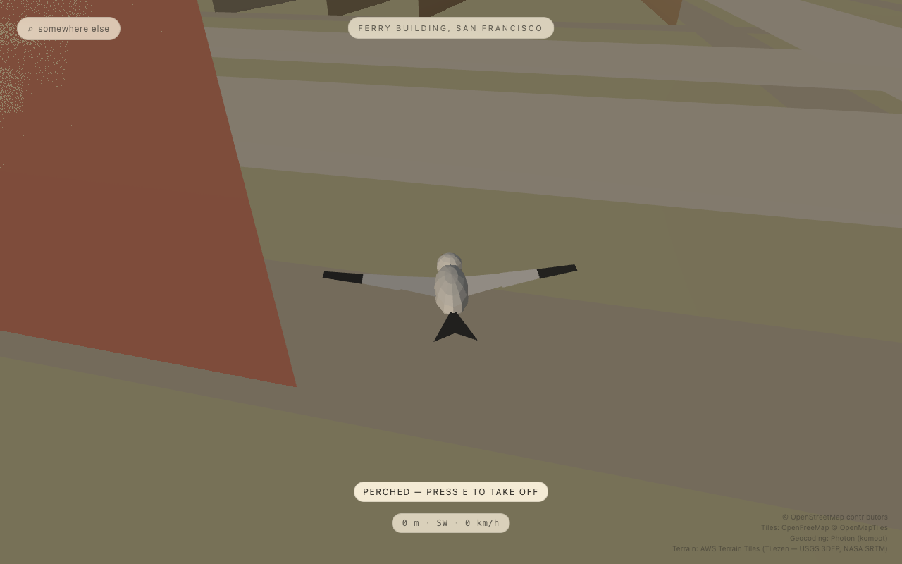

# birds-fly-view

**Become a bird and fly your real neighborhood.**

<p align="center">
  <a href="https://maninae.github.io/birds-fly-view/"></a>
  
  
</p>

---

**[Take off →](https://maninae.github.io/birds-fly-view/)**

Type any Bay Area address and spawn as a bird above it. The world below is real — the actual street grid, real building footprints at their real heights, the parks, the freeways, the Bay, the hills — streamed live from OpenStreetMap and rendered as a warm golden-hour dream. Flap, soar, bank between towers, perch on any rooftop, then drop to the sidewalk and walk your own street.

- **Real everywhere**: buildings, streets, freeways, parks, water, and terrain come from live map data — Twin Peaks rises, the Embarcadero curves, your house is where your house is
- **A bird, not a cockpit**: no throttle, no instruments, no stall — calm soaring physics built for sightseeing
- **Land anywhere**: perch on rooftops, walk at street level, take off again
- **Instant**: no account, no API key, no install — it's a static page
- **Photoreal mode**: optionally paste your own Google Maps key to fly Google's photogrammetry mesh instead



| Twin Peaks & Sutro Tower | Perched on a rooftop |
|---|---|
|  |  |

## Controls

| Input | Action |
|---|---|
| <kbd>A</kbd>/<kbd>D</kbd> or <kbd>←</kbd>/<kbd>→</kbd> | bank to turn |
| <kbd>W</kbd>/<kbd>S</kbd> or <kbd>↑</kbd>/<kbd>↓</kbd> | pitch — trade height for speed |
| <kbd>Space</kbd> | flap (hold for a climb; hold on the ground to take off) |
| <kbd>Shift</kbd> | air brake — bleeds speed hard when you're low and committing to land |
| <kbd>E</kbd> | land on the surface below / take off from a perch |
| <kbd>V</kbd> | chase cam ⇄ bird's eyes |
| <kbd>Esc</kbd> | fly somewhere else (address search mid-flight) |

## How it works

No backend, no build-time data. Everything streams into the browser from free, keyless sources:

```
address ──▶ Photon geocoder (bbox: SF Bay)
                │
                ▼  lat/lon → local ENU meters
OpenFreeMap vector tiles (z14, OpenMapTiles schema)
   buildings + heights · roads by class · water · parks
                │  pbf → footprints → extruded, merged per-tile meshes
                ▼
AWS Terrarium tiles (z12) ──▶ terrain mesh + elevation sampler
                │
                ▼
three.js · one golden-hour palette · FogExp2 hides the streaming edge
```

Tiles stream in a ring around the bird on a ~4 ms/frame mesh-building budget; fog is tuned so the world materializes just beyond what you can see. Landing raycasts hit the same merged meshes, so every roof is a perch.

Photoreal mode swaps the whole world for [Google Photorealistic 3D Tiles](https://developers.google.com/maps/documentation/tile/3d-tiles) via [3DTilesRendererJS](https://github.com/NASA-AMMOS/3DTilesRendererJS) — same bird, same controls. It needs your own Google Maps Platform key (billing-enabled project, Map Tiles API, ~1,000 free sessions/month). The key is entered in-app and stored only in your browser's localStorage.

> [!NOTE]
> Geocoding is currently scoped to the SF Bay Area (San Jose → San Francisco → Oakland). The map data is global, so widening the bbox in `src/config.ts` unlocks anywhere OpenStreetMap knows.

## Run it locally

```bash
git clone https://github.com/Maninae/birds-fly-view.git
cd birds-fly-view && npm install
npm run dev
```

`npm test` runs the geo/physics unit tests; `npm run build` produces the static site in `dist/`.

## Data credits

Map data © [OpenStreetMap](https://www.openstreetmap.org/copyright) contributors · vector tiles by [OpenFreeMap](https://openfreemap.org/) © OpenMapTiles · geocoding by [Photon](https://photon.komoot.io/) (komoot) · terrain from [AWS Terrain Tiles](https://registry.opendata.aws/terrain-tiles/) (Tilezen — USGS 3DEP, NASA SRTM) · photoreal mode © Google.

## License

[MIT](LICENSE) — Owen Wang
